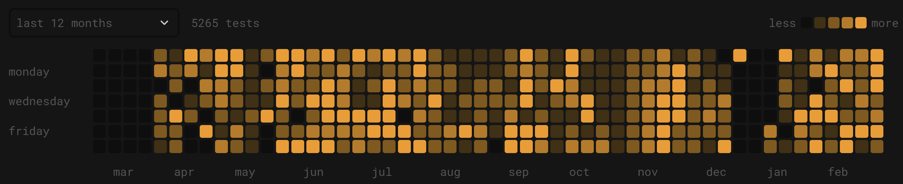

<h1 align="center">Hi, I'm KarnVen 👋</h1>

  

A bit more about me:

- 👨‍💻 I'm a **Full-Stack Developer** building end-to-end applications with a focus on clean code and great user experiences.
- 🤖 I love architecting **AI Agents** and creating intricate **n8n workflows** to automate tasks and boost productivity.
- 🏆 I'm an avid **hackathon participant** and a firm believer in learning by doing. I thrive under pressure and enjoy collaborating to bring ideas to life.
- 🌱 Beyond the keyboard, I'm a lifelong learner. You can find me reading a new book, practicing calisthenics, learning a new song on the guitar, or experimenting in the kitchen.

 

  
  
  
  
  
  
  
  
  
  
  
  
  
  
  
  
  
  
  
  
  
  
  
  
  
  

 

<table>
<tr>
<td width="58%" valign="top">

<h3>Projects</h3>

- 🐚 [**kaiVen**](https://github.com/karnVen/ShellOrigin) — `$ gcc core.c ai.c -o kaiVen` &nbsp;#Built a raw Unix shell.
- 🤖 [**GitPost**](https://github.com/karnVen/GitPost) — Turn git push into clout; my automated LinkedIn hype-man
- 💼 [**SavingsYogi**](https://savingsyogi.com) — Next-gen personal finance platform
- 🎓 [**EduVen**](https://github.com/karnVen/EduVen) — Because reading PDFs is boring; learn in a gamified world
- 📚 [**HakiVen**](https://github.com/karnVen/HakiVen-Study-Tracker-) — Track study habits with Firebase-powered dashboards
- 👾 [**PokeMemo**](https://github.com/karnVen/MemroyCard) — A memory test powered by the **Fisher-Yates Algorithm**

<h3>⚡ Experience</h3>

<table>
<tr>
<td align="left">

**🏢 [EasyTax Global IT Solutions](https://easytax.live)** 
`Developer` · Bhamashah Techno Hub, Jaipur · Apr 2026 – Present

↳ Rebuilt Laravel multi-role platform used daily by 100s of agents 
↳ Drupal site redesign: SEO · lead-gen pipeline · payment flow 
`Laravel` `PHP` `Drupal` `MySQL` `AWS`

</td>
</tr>
<tr>
<td align="left">

**🌐 Savings Yogi** 
`Technical Solutions Intern` · Remote (Frisco, TX) · Feb – Mar 2026

↳ Architected full company website solo — zero to production 
↳ Custom CMS → non-tech team ships content independently 
↳ Delivered a working product in under 4 weeks 
`React` `Node.js` `Firebase` `Custom CMS`

</td>
</tr>
</table>

</td>
<td width="42%" valign="top" align="center">

  

&nbsp;
&nbsp;
&nbsp;

  

  

<kbd>MonkeyType</kbd> <code>🔥 198d Max • ⚡ 50d Cur • 🚀 98wpm Best</code>

 

  

</td>
</tr>
</table>

 

  <picture>
    <source media="(prefers-color-scheme: dark)" srcset="https://raw.githubusercontent.com/karnVen/karnVen/output/pacman-contribution-graph-dark.svg" />
    <source media="(prefers-color-scheme: light)" srcset="https://raw.githubusercontent.com/karnVen/karnVen/output/pacman-contribution-graph.svg" />
    
  </picture>

